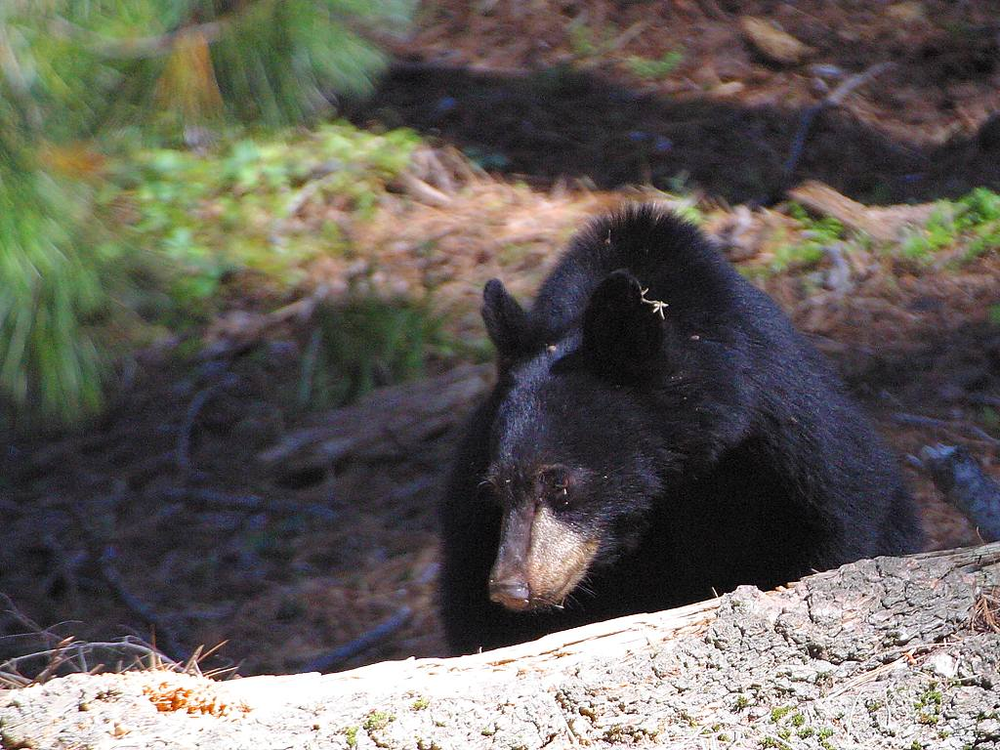
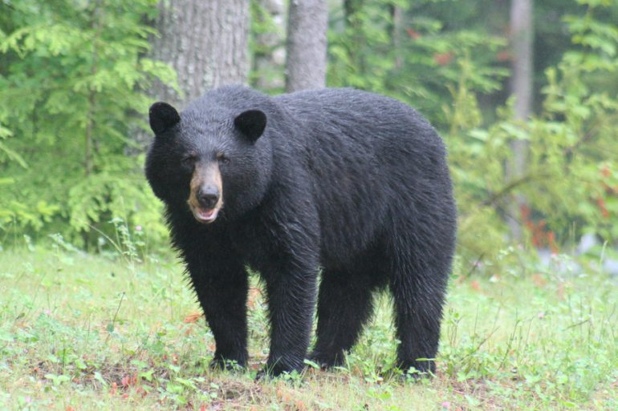
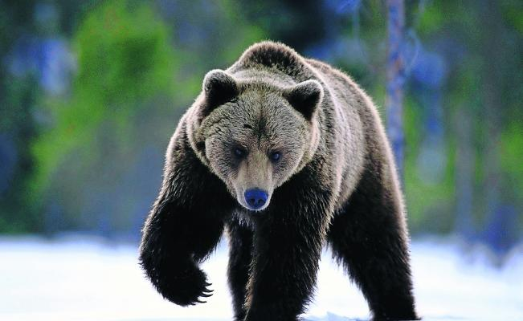
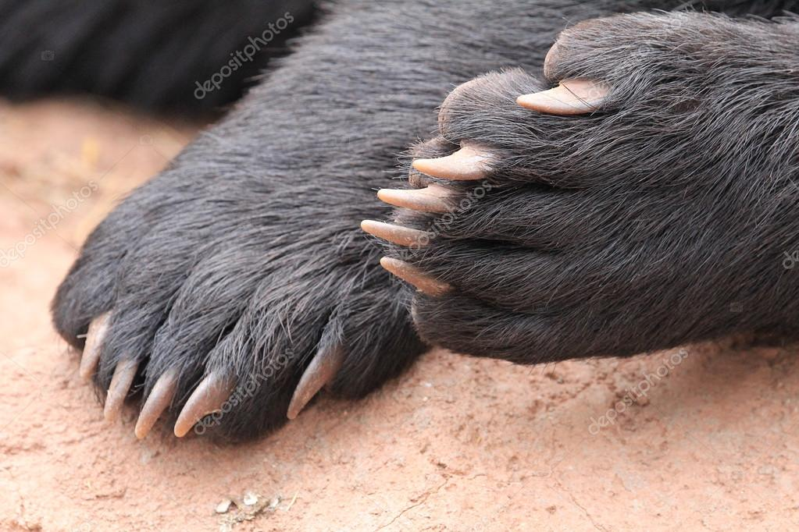

<!DOCTYPE html>
<html lang="en">
  <head>
	  <link href="https://fonts.googleapis.com/css?family=Jomolhari&display=swap" rel="stylesheet">
    <meta charset="utf-8">
	<meta http-equiv="X-UA-Compatible" content="IE=edge">
	<meta name="viewport" content="width=device-width, initial-scale=1">
    <title>OsoNegro</title>
    <!-- Bootstrap -->
	<link href="css/bootstrap-4.3.1.css" rel="stylesheet">
	
  </head>
  <body style="padding-top: 70px">
  <nav class="navbar fixed-top navbar-expand-lg navbar-light bg-light offset-xl-0 col-xl-12"> 
    <button class="navbar-toggler" type="button" data-toggle="collapse" data-target="#navbarSupportedContent1" aria-controls="navbarSupportedContent1" aria-expanded="false" aria-label="Toggle navigation">  </button>
    

      <ul class="navbar-nav ml-auto">
        <li class="nav-item"> <a class="nav-link Text-first-para" href="#">Home</a></li>
        <li class="nav-item dropdown"> <a class="nav-link Text-first-para" href="#">Contact Us</a></li>
      </ul>
      <form class="form-inline my-2 my-lg-0">
      </form>
    

  </nav>

  

    

      

        

          

          

            <h1 class="Text-Bold">Ursus americanus</h1>
            
 El oso negro (Ursus americanus), también llamado oso negro americano, es una especie de mamífero carnívoro de la familia de los úrsidos. Es el oso más común en Norteamérica. Se encuentra en una superficie geográfica que se extiende desde el norte de Canadá y Alaska hasta la Sierra Gorda en Querétaro, México, y de las costas atlánticas a las costas pacíficas de Norteamérica. Está presente en un gran número de estados estadounidenses y en todas las provincias canadienses. Prefiere los bosques y las montañas, donde encuentra su comida y puede ocultarse. La población de osos negros era hace tiempo, seguramente, de dos millones de individuos. En la actualidad, la especie está protegida y se considera que existen entre 500.000 y 750.000 osos negros en ese continente. La subespecie de Nuevo León, México se considera en Peligro de Extinción.Ursus americanusUrsus americanus 

          

        

      

  

    

      
<a href="https://www.google.com/imgres?imgurl=https%3A%2F%2Fdam.muyinteresante.com.mx%2Fwp-content%2Fuploads%2F2018%2F09%2FOso-02-copia.jpg&amp;imgrefurl=https%3A%2F%2Fwww.muyinteresante.com.mx%2Fjunior%2Foso-negro-en-una-excursion%2F&amp;docid=zmmIXdQJF9yE4M&amp;tbnid=KNB5Ajrv-GaSWM%3A&amp;vet=10ahUKEwiW2q26yavlAhXuRt8KHeIWDJMQMwhKKAAwAA..i&amp;w=900&amp;h=600&amp;bih=969&amp;biw=1920&amp;q=oso%20negro&amp;ved=0ahUKEwiW2q26yavlAhXuRt8KHeIWDJMQMwhKKAAwAA&amp;iact=mrc&amp;uact=8">
        

          
Oso en ambiente calido

        &nbsp;

      </a>&nbsp;      

      
<a href="https://animalesis.com/osos/negros/">
        

          
Oso en ambiente de nieve

        &nbsp;

      </a>&nbsp;
        
 

 

      

      
<a href="https://sp.depositphotos.com/126470798/stock-photo-black-bear-paw-with-claws.html">
        

          
Piernas de Oso en detalle

        &nbsp;

      </a>&nbsp;      

      

        <h1><strong class="Text-Bold"> Características físicas</strong></h1>
        
El oso negro mide generalmente entre 140 y 200 cm de largo. Su altura hasta la cruz es de entre 100 y 130 cm. El oso negro es más pequeño que el oso polar y el oso pardo. Su peso depende de la edad, del sexo del animal y la temporada: en otoño, el oso negro engorda y acumula reservas de grasa con el fin de pasar el invierno. Las hembras pesan entre 40 kg y 180 kg (media de 70–80 kg), mientras que los machos pesan entre 60 y 275 kg (media de 120 kg). Se encontró un macho de 400 kg en el condado de Craven, en Carolina del Norte.​ Black bear large.jpg El color del pelaje varía del negro al blanco, pasando por numerosos matices: chocolate, marrón, canela y rubio son colores bastante más frecuentes en los bosques del oeste de Estados Unidos y en Canadá que en las regiones del este. Al sur de Alaska y en la Columbia Británica vive el oso Kermode, llamado también spirit bear,​ una subespecie de oso negro cuyo pelo es de un tono blanco mate. Osos de un gris azulado ocupan la bahía de los Glaciares en Alaska.​ Todos estos animales pertenecen a la especie del oso negro americano. Los albinos son muy raros. Algunos individuos tienen una o más manchas blancas sobre el cuello o en el pecho. El oso negro muda y su gruesa piel le protege contra las picaduras de los insectos y contra los rigores del invierno. Los osos negros son capaces de tenerse de pie y de andar sobre sus patas traseras: éstas son ligeramente más largas (13 a 18 cm)​ que las patas delanteras. Cada pata está dotada con cinco dedos con garras no retráctiles utilizadas para rasgar, cavar y subir a los árboles. Un golpe de una pata delantera basta para matar a un ciervo adulto. El oso negro posee ojos pequeños, orejas redondeadas, un largo morro puntiagudo de color marrón, y una cola relativamente corta (8–14 cm). Sus ojos son marrones. Su visión no es especialmente buena pero la experiencia pone de manifiesto que le permite distinguir los colores. En cambio, su oído y su olfato están muy desarrollados; su lengua ágil y sus labios móviles le permiten comer pequeñas bayas y hormigas. Por último, su perfil facial recto y su morro puntiagudo lo diferencian del Grizzly, que vive también en América del Norte. El oso negro es sin embargo más pequeño.

        
&nbsp;

      &nbsp;

    

  

  

    
Terms &amp; Conditions | Privacy Policy | Copyright @<a href="mailto:tuNombrede@email.com?subject=Website Enquiry">2019</a>

  

<meta name="description" content="El oso negro (Ursus americanus), tambi&eacute;n llamado oso negro americano, es una especie de mam&iacute;fero carn&iacute;voro de la familia de los &uacute;rsidos.">

	<!-- body code goes here -->

	<!-- jQuery (necessary for Bootstrap's JavaScript plugins) --> 
	

	<!-- Include all compiled plugins (below), or include individual files as needed -->
	 
  
</body>
</html>
